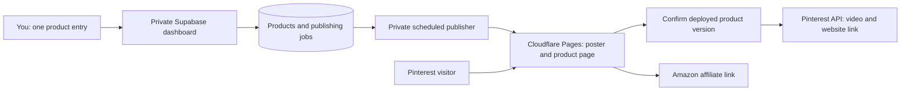

# The Curated Pick: enter each product once

Recommendation, checked September 8, 2026: use Supabase's private dashboard to maintain products, a private scheduled publisher to create Pinterest Pins, and Cloudflare Pages to serve the website. Keep content management out of the public website.

## What is implemented now

The public app no longer includes the admin dashboard, product creation screen, article creation/deletion controls, password gate, role-switching demos, or automatic admin access. New visitors start as guests. Existing local profiles have their obsolete role removed when loaded. Existing locally saved products and articles are retained.

This change does **not** connect Supabase, publish to Pinterest, deploy a website, or implement Amazon price updates. The design below is the next implementation, not a description of a working integration.

## What the current code actually does

- `src/data/initialData.ts` provides sample products, prices, reviews, deals, and articles.
- `src/App.tsx` loads products and articles from browser localStorage. Adding a product previously changed only that browser; it did not publish it for other visitors.
- Profiles, reviews, wishlist activity, and price-alert preferences are local features. There is no shared authentication, email delivery, or price-monitoring service in this folder.
- `server.ts` serves the app and an AI chat endpoint. It contains no Amazon or Pinterest integration. Its public chat endpoint has no application-level authentication or rate limiting.
- Products currently open in modals, and the share helper sends the affiliate URL. Dedicated website product URLs still need implementing.

The removed password was embedded in client code. If it was ever deployed, treat it as exposed and change it anywhere it was reused; deleting it here does not erase Git history or old deployments.

## Daily workflow

1. Open the Supabase Table Editor under your own protected Supabase account.
2. Enter one product: title, useful description, category, Amazon affiliate URL, website poster, Pinterest video, and target board. Set its status to `ready` when complete.
3. A scheduled publisher validates the record and triggers a website build. The build exports only published product fields and renders a permanent product page such as `/products/desk-lamp/` with a poster, affiliate disclosure, and Amazon button.
4. After verifying the deployment succeeded and that exact product version is publicly available, the publisher uploads the video through Pinterest's official API and creates the Pin using the same title/description and the website product URL.
5. The publisher saves the resulting Pin ID. To replace the website poster later, update only the poster field; this rebuilds the page without uploading another video or creating another Pin.

Pinterest does not supply the second destination for you: if a Pin links to your website, that Pin does not also tell the website which Amazon affiliate URL to use. Store both destinations in the original record. This is why a private product record should come first.

## Small data model

| Data | Fields |
| --- | --- |
| Product content | `id`, permanent `slug`, `title`, `description`, `category`, `asin`, `amazon_affiliate_url`, `poster_url`, `status`, `content_version` |
| Private publishing job | `product_id`, `video_storage_path`, `board_id`, `media_id`, `pin_id`, `state`, `attempts`, `next_attempt_at`, `last_error`, `deployed_version` |
| Optional approved price data | `product_id`, `amount`, `currency`, `checked_at`, `expires_at`, `source` |

The existing `imageUrl` maps to `poster_url`. Keep the video separate. Store a compressed, licensed poster; stage the video in private storage for upload, then remove the staged copy after confirmed success if you have a separate original backup. Do not use database rows to store video blobs.

## Security and reliable publishing

Enable MFA on the owner account. Enable row-level security and deny public writes to products, jobs, and storage. Keep drafts, publishing jobs, and tokens private. Export an explicit allowlist of public content at build time; the website needs no database credentials or write API. Supabase secret/service-role keys bypass RLS and must stay in trusted jobs, functions, and build secrets. [Supabase security guidance](https://supabase.com/docs/guides/database/secure-data)

Use Supabase Cron to invoke an authenticated Edge Function that processes a small batch of jobs. Store its invocation credential in Vault and Pinterest credentials in function secrets. Public visitors must not be able to invoke publishing. [Scheduled functions](https://supabase.com/docs/guides/functions/schedule-functions)

Claim jobs atomically so overlapping runs cannot publish the same row. Persist progress between video registration, upload, processing, deployment, and Pin creation. Retry rate limits with backoff. If a Pin-creation request times out after submission, mark it for reconciliation instead of blindly reposting. Save the Pin ID before considering the job complete. Use distinct website-update and Pin-creation states so poster changes cannot create duplicates.

Serve the last successful static catalog if publishing or Supabase fails. Keep backups outside the free database. Failed jobs must be visible in the private dashboard. Automation can reduce daily work; it cannot guarantee approval, uptime, or zero maintenance.

## What $0 covers, and the limits

| Service | Free allowance / constraint |
| --- | --- |
| Supabase | 500 MB database, 1 GB storage, 5 GB egress, 500,000 Edge Function invocations; free projects can pause after a week of inactivity and do not include automatic backups. |
| Cloudflare Pages | 500 builds/month, 20,000 files, 25 MiB maximum per asset. Batch edits into builds. Purely static requests are free and unlimited. A new custom domain still costs money; use the provided subdomain or your existing domain. |
| Pinterest API | Public automated publishing requires approved Standard access. Trial Pins are visible only to their creator. This is an approval dependency, not something a paid automation subscription fixes. |

[Supabase pricing](https://supabase.com/pricing), [Pages limits](https://developers.cloudflare.com/pages/platform/limits/), [static request billing](https://developers.cloudflare.com/pages/functions/routing/), [Pinterest access tiers](https://developer.pinterest.com/docs/key-concepts/access-tiers/)

Supabase Free functions have a 150-second wall-clock limit. Process video-upload progress across jobs; do not transcode videos inside those functions. Prepare video files before submission and verify supported upload sizes during implementation. [Function limits](https://supabase.com/docs/guides/functions/limits)

Until Pinterest Standard access is approved, generate the title, description, and website URL from the record, then paste them into Pinterest's native video publisher. This avoids rewriting the product but still requires a manual posting step. Fully automatic public posting cannot be promised before approval.

## Amazon pricing and Pinterest rules

For launch without eligible Amazon API access, replace sample prices, discounts, availability claims, and price-alert promises with **Check price on Amazon**. A personal website does not itself update prices. Do not scrape Amazon or present manually entered prices as live.

Amazon's rules allow price/availability display through Amazon-served content or approved API data under the applicable license. The current Creators API introduction lists enrollment, API registration and credentials, and at least 10 qualifying sales in the past 30 days for the stated access route. Check eligibility in the relevant marketplace. [Amazon program policies](https://affiliate-program.amazon.com/help/operating/policies), [Creators API prerequisites](https://affiliate-program.amazon.com/creatorsapi/docs/en-us/introduction)

If eligible later, fetch prices in a private job or server function, respect Amazon's refresh/cache/disclosure requirements, show timestamps where required, and hide expired data if refresh fails. This is periodically refreshed pricing, not a guarantee of the checkout price. Do not put exact prices into evergreen Pin videos or descriptions.

Pinterest permits affiliate content subject to its rules; a separate website is not universally required by Pinterest, and is not a bypass or protection from suspension. Use useful, original product pages, transparent affiliate disclosures, and media you have permission to use. Your Amazon account's approved sites/channels and marketplace terms also matter. [Pinterest affiliate guidelines](https://policy.pinterest.com/en/commercial-and-branded-content-guidelines)

## Migration order

1. Export any products/articles added in the old browser before clearing its storage. Seed them into Supabase alongside reviewed real content; remove sample deals, ratings, and unsupported marketing claims before launch.
2. Create the private tables, storage policies, and owner access. Test that public credentials cannot read drafts or mutate anything.
3. Replace the local product/blog catalog with the generated published catalog; keep only personal preferences in localStorage. Add permanent product URLs with rendered HTML, metadata, poster previews, and working reloads.
4. Deploy the static website with a frontend-only build (`npx vite build` initially, extended with page generation). Do not deploy the bundled Express server as a public static asset. The existing `/api/chat` needs a separate guarded backend or removal for this architecture; it will not work on static hosting by itself.
5. Connect Pinterest OAuth, test video publishing in Trial, obtain Standard access, then enable production jobs. Test failed uploads, expired tokens, ambiguous timeouts, duplicate runs, and poster-only edits.
6. Add approved Amazon pricing only when eligible. Real email alerts and shared visitor accounts are separate features; the current local demos do not provide them.

Deployment and integration require your hosting project, Supabase project, Pinterest API approval/OAuth, and Amazon eligibility if prices are desired. None of those external accounts were configured by this admin-removal change.
